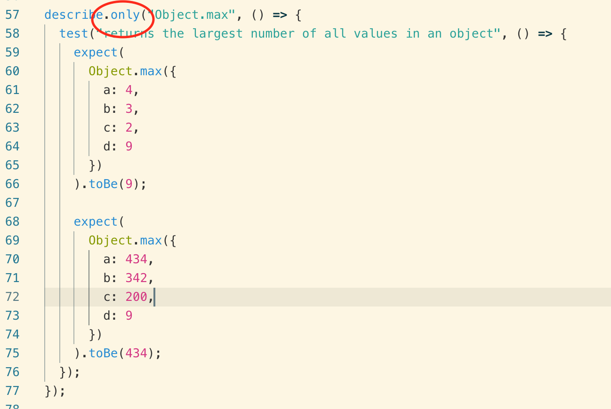

# Tasks

### Day 1: Advanced Objects

In class we will aim to solve `Object.size` and `Object.min`.

Then, continue with the following instructions

1. Make sure you understand the solutions to the first two functions

2. Take a look at the next function, `Object.max`. Think about the steps you will need to take to identify the maximum value in an object, and write the steps out in pseudocode.

3. Add a `.only` to the first test for this function and run it with `npm test`, to see it fail (Red, Green, Refactor!):

4. Implement the code for this function.

5. Run the tests again, hopefully they now pass.

6. Put a `.only` on the next test and repeat the process. Does the code you've already written pass this test, or do you need to add some extra functionality?

7. When all the tests have passed for the `Object.max` function remove the `.only` from the individual test and add it to the surrounding `describe` block instead to check the whole set of tests all pass:

8. Continue this process for the remaining functions:

   - `clone`
   - `get`
   - `has`
   - `invert`
   - `sum`
   - `isEqual`

### Day 2: Functions as values
